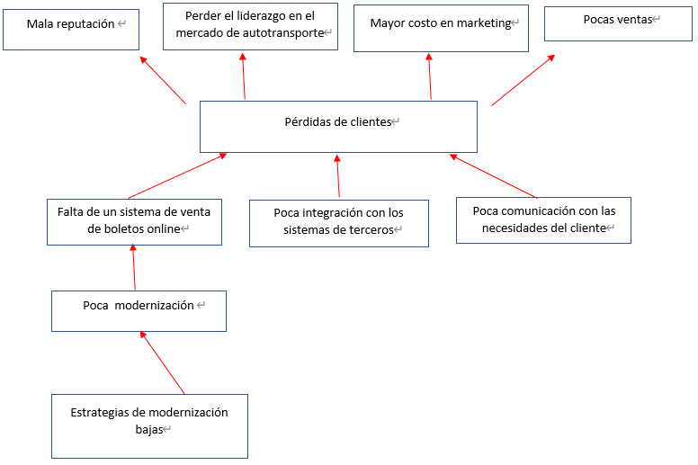
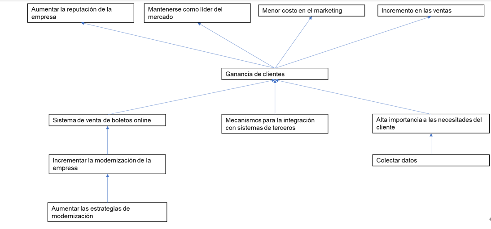
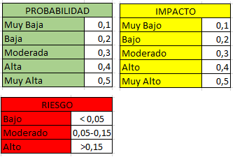
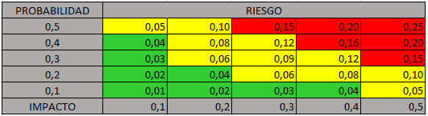
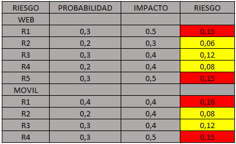

# Examen Parcial I Evaluación y administración de proyectos
# 1. Árbol de problemas

# 2. Árbol de objetivos

# 3. ¿A qué objetivo de negocio aporta cada característica?
| CAR-01 | El sistema debe permitir realizar la compra de boletos desde un navegador web  | Alta| ON-1|
|--|--| --| --|
| CAR-02 | El sistema debe permitir realizar la impresión y re-impresión de boletos | Alta| ON-1| 
|--|--| --| --|
| CAR-03 | el sistema debe permitir realizar consulta de rutas y horarios de corridas | Alta| ON-1| 
|--|--| --| --|
| CAR-04 | El sistema debe permitir realizar cancelación de boletos | Alta| ON-1| 
|--|--| --| --|
| CAR-05 | El sistema debe permitir a un administrador generar reportes de actividad de usuarios y sistemas externos | Media| ON-3| 
|--|--| --| --|
| CAR-06 | El sistema debe exportar servicios web que permitan a aplicaciones externas realizar las operaciones de consulta, compra y cancelación de boletos | Media| ON-2| 
|--|--| --| --|
| CAR-07 | El sistema debe soportar de manera simultánea por lo menos cien interacciones (usuarios o sistemas externos) | Alta| ON-2| 
|--|--| --| --|
| CAR-08 | El sistema debe garantizar la seguridad de los datos que se ingresan | Alta| ON-1| 
|--|--| --| --|
| CAR-09 | el sistema debe estar disponible 24 horas al día y, en caso de falla, retomar actividad en, máximo cinco minutos | Media| ON-1| 
|--|--| --| --|
| CAR-010 | El sistema debe integrarse con redes sociales (Facebook, Twitter y Foursquare) | Baja| ON-2| 
|--|--| --| --|
| CAR-11 | El sistema debe permitir dos niveles de usuario: cliente y administrador | Alta| ON-1| 
|--|--| --| --|
| CAR-12 | El sistema debe permitir realizar pagos con tarjeta de crédito conectándose a un servicio de terceros | Alta| ON-2| 

#  4. Alcance del proyecto

| Número de entrega | Tema principal  |  ID de características a incluir| 
|--|--| --| 
| 1.0 | Funcionalidad básica  | CAR-01, CAR-02, CAR-03,CAR-04, CAR-11 | 
|--|--| --|
| 2.0 | Estabilidad del sistema e integración con terceros  |  CAR-05, CAR-06, CAR-07, CAR-08, CAR-09, CAR-10, CAR-12 
|--|--| --| 
| 3.0 | Visibilidad  |  CAR-10 
|--|--| --| 

# 5. Listado de interesados

| Rol / Grupo / Interesado | Participación | Visión del problema
|--|--|--|
| Empresas VTP | Beneficiario | Adquirir de forma sencilla boletos de autobús de ADM mediante sus sistemas. |
| Competencia de ADM | Oponente | Implementar una estrategia de modernización de sus esquemas de ventas. |
| Trabajadores en las taquillas de las terminales y módulos en centros comerciales | Perjudicado | Conseguir un nuevo trabajo dentro del sector. |

# 6. Identificaion de Riesgos

**Impacto, Probabilidad y Riesgo**
-

**Fase WEB:**
-
- **R1 Fallas en el servidor:** Los problemas referente a la información que suministra el servidor para el funcionamiento de la aplicación retrasan el flujo de ventas generando perdidas de clientes.

- **R2 Perdida de información:** El factor humano está involucrado en probales perdidas de informacion que afectarian el rendimiento de una venta.

- **R3 Caída de Red:** Ninguna aplicacion web esta exenta de una falla con un operador de internet que interfiera al equipo conectarse a la pagina.

- **R4 Problemas de funcionamiento (Bugs):** Factor humano impredecible a fallas en el codigo.

- **R5 Cambios de ultimo momento exigidos por los principales interesados:** Cambios que afectan la fecha pactada de entrega asi como el valor de la aplicación.

**Fase Movil:**
-
- **R1 Compatibilidad:** Una aplicaión movil enfrenta diversos dispositivos y capacidades de los mismos obligando a los usuarios a buscar la mas comoda.

- **R2 Problemas de funcionamiento (Bugs):** Factor humano impredecible a fallas en el codigo.

- **R3 Conectividad:** Los dispositivos moviles enfrentan problemas con su acceso a internet dependiendo de la zona en la que se encuentren el usuario el cual buscara una solucion alterna.

- **R4 Cambios de ultimo momento exigidos por los principales interesados:** Cambios que afectan la fecha pactada de entrega asi como el valor de la aplicación.

**MPI**
-

**RIESGOS**
-

# **Estrategias de Respuesta a Riesgos:**

**WEB**
-
1. **R1:** Para evitar caídas del servidor y errores en los datos debido al sobrecalentamiento y a una humedad demasiado alta deberían instalarse sistemas de ventilación y enfriamiento de gran potencia, al igual que un servidor de respaldo que brinde la informacion necesaria para el funcionamiento de la aplicacion en un periodo de mantenimiento.

2. **R2:** Un backup responsable es la solucion a posibles perdidas de informacion del factor humano.

3. **R3:** La caida de RED de un operador es un problema inevitable pero que puede ser reducido contratando servicios con bajos estandares de dicho problema y alta capacidad de reacciónn a fallos.

4. **R4:** Un equipo de trabajo capacitado que pueda brindar una solucion rapida y efectiva a posibles fallos.

5. **R5:** Planificar intervalos de tiempo que brinden respaldo a posibles cambios, hacer un análisis de lo que ya está y que tan traumático puede ser para el proyecto las modificaciones de los interesados.

**MOVI**
-
1. **R1:** El desarrollo movil requiere ir de la mano con las actualizaciónes que pueden ser emuladas para una mejor experiencia de sus usuarios.

2. **R2:** Un equipo de trabajo capacitado que pueda brindar una solucion rapida y efectiva a posibles fallos.

3. **R3:** Conservar los puntos de venta fisico en zonas vulnerables en conectividad.

4. **R4:** Planificar intervalos de tiempo que brinden respaldo a posibles cambios, hacer un análisis de lo que ya está y que tan traumático puede ser para el proyecto las modificaciones de los interesados.

# CONCLUSIONES
1. Se puede concluir que todo proyecto que tengamos en mente e incluso los ya presentes 
están ligados por un estándar que vela por su correcto desempeño u oportuno cierre.
Después de realizar las diferentes actividades se pudo observar los diversos factores
que ayudan a una persona x a prevenir malas decisiones para su proyecto o monitorear su estado calificando la importancia de estas decisiones o características.
2. Podemos concluir que el éxito de un proyecto no depende únicamente de una persona o grupo
con una necesidad presente, existen factores externos tales como riesgos o grupos de
interesados tanto benéfico como perjudicial en el caso de competencias.
Factores externos que deben ser estudiados y evaluados en el desarrollo de los proyectos
a realizar.
3. En el transcurso de un proyecto hay formas de evaluar los riesgos involucrados en su
desarrollo, tales  como la maya de probabilidad e impacto que brinda una idea de a que
riesgos enfocar una mayor atención o lo factible que puede ser continuar o descartar
 el proyecto.
 4. De acuerdo con lo visto en clase los interesados en el proyecto son personas u organizaciones que están involucrados en el proyecto o aquellos que sus intereses se ven o pueden verse afectados positiva o negativamente por la ejecución o terminación del proyecto. En conclusión es importante identificar a cada interesado para evitar que el proyecto se desvíe de su curso y evitar en lo posible cambios inesperados.
